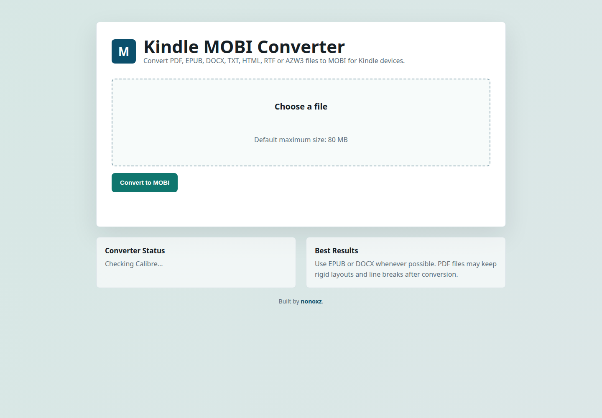

# Kindle MOBI Converter

A lightweight web application for converting ebooks and documents to MOBI, designed for Kindle users.

Built by [nonoxz](https://github.com/nonoxz).



## Features

- Convert `EPUB`, `PDF`, `DOCX`, `TXT`, `HTML`, `RTF` and `AZW3` files to `MOBI`.
- Browser-based upload flow with progress feedback.
- Automatic download when the conversion is complete.
- Manual download link as a fallback.
- Backend powered by Node.js and Calibre's `ebook-convert`.
- No npm runtime dependencies.
- Dockerfile included for Linux deployments.

## Requirements

- Node.js 20 or newer
- Calibre installed on the machine running the server
- `ebook-convert` available in `PATH`

On Ubuntu/Debian:

```bash
sudo apt update
sudo apt install calibre
```

Check the converter:

```bash
ebook-convert --version
```

## Local Usage

Clone the repository and start the server:

```bash
git clone https://github.com/nonoxz/kindle-mobi-converter.git
cd kindle-mobi-converter
npm start
```

Open the app:

```text
http://localhost:3000
```

Then:

1. Choose an ebook or document file.
2. Click **Convert to MOBI**.
3. Wait for the upload and conversion progress to finish.
4. The MOBI file should download automatically.
5. If the browser blocks automatic download, use the manual download link shown on screen.

## Configuration

Environment variables:

| Variable | Default | Description |
| --- | ---: | --- |
| `PORT` | `3000` | HTTP server port. |
| `MAX_UPLOAD_MB` | `80` | Maximum upload size in megabytes. |
| `CONVERSION_TIMEOUT_MS` | `180000` | Maximum conversion time per file. |

Example:

```bash
PORT=8080 MAX_UPLOAD_MB=120 npm start
```

## Docker

Build and run:

```bash
docker build -t kindle-mobi-converter .
docker run --rm -p 3000:3000 kindle-mobi-converter
```

The Docker image installs Calibre inside the container.

## Deployment Notes

GitHub Pages is not enough for this project because ebook conversion requires a backend process that can run `ebook-convert`.

Recommended deployment targets:

- A Linux VPS with Node.js and Calibre installed.
- Docker on a server.
- A platform that supports custom Docker images.

## Security Notes

This first version is suitable for personal or internal use. Before exposing it publicly, consider adding:

- authentication
- rate limiting
- background job queue
- antivirus scanning or file sandboxing
- scheduled cleanup policies
- external object storage for generated files

## License

MIT License. See [LICENSE](LICENSE).
